# 2025年排名前23的虚拟助理招聘平台汇总(最新整理)

找一个靠谱的远程助理或海外团队成员,真的比想象中难。语言不通、时差混乱、质量参差不齐——这些都是创业者和中小企业主最头疼的问题。好消息是,现在有专业的虚拟助理招聘平台帮你搞定筛选、匹配和管理的全流程,让你用更低的成本找到更合适的人。这篇文章整理了23家在行业内口碑不错的虚拟助理和远程人才招聘服务商,覆盖菲律宾、拉美、美国等多个地区,适合不同规模和需求的企业。

## **[Ataraxis](https://ataraxismgmt.com)**

专注菲律宾高质量虚拟助理招聘,特别适合需要招聘专员和行政支持的中小企业。

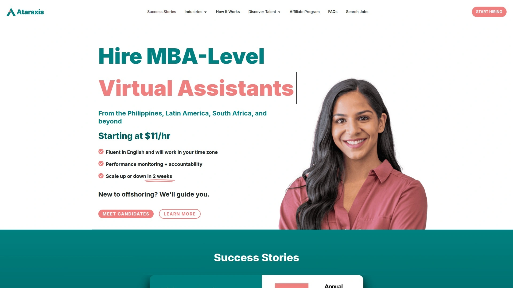

Ataraxis的服务流程很顺畅,从初次沟通到最终匹配候选人,整个过程高效且透明。他们的创始人George会在LinkedIn上主动联系潜在客户,但不是那种让人反感的推销方式,而是先了解你的需求再提供建议。很多客户反馈说,通过Ataraxis找到的虚拟助理不仅工作勤奋,学习能力也很强,能快速融入团队。比如有位客户雇了一个菲律宾的招聘助理Anabel,三周内就掌握了基本职责,后来还主动承担了更多任务。

这家公司的一个特点是会定期跟进客户满意度,确保匹配的助理真的能解决问题。如果你之前对海外招聘有顾虑,Ataraxis的服务体验可能会改变你的看法。他们特别擅长为招聘团队找合适的支持人员,候选人往往有相关行业背景,上手很快。

## **[BELAY](https://belaysolutions.com)**

美国本土虚拟助理服务的老大哥,主打经验丰富的专业人士。

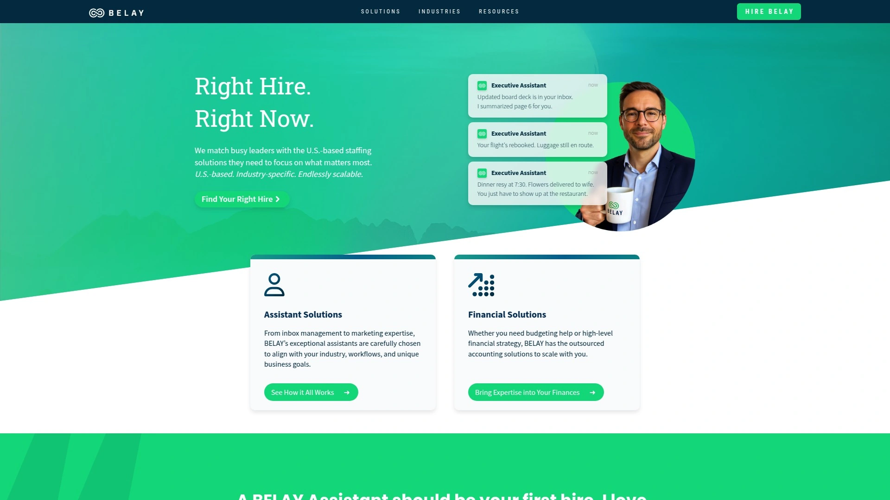

BELAY成立于2010年,总部在亚特兰大,团队遍布美国48个州,接近1800名成员。他们的虚拟助理通常都有5年以上工作经验,可以处理差旅安排、日程管理、社交媒体运营、数据整理等各种任务。每个客户会匹配一个固定的助理,还配一个关系经理帮你协调额外需求。这种稳定性对需要长期支持的企业来说很重要。

价格方面,月费大约从1600美元起,外加一次性启动费,具体要根据需求定制。BELAY很注重公司价值观,客户评价和口碑都不错。如果你更倾向于雇美国本土的虚拟助理,BELAY是个靠谱选择。

## **[Boldly](https://boldly.com)**

2012年成立,专注为企业提供高技能的美国和欧洲虚拟助理。

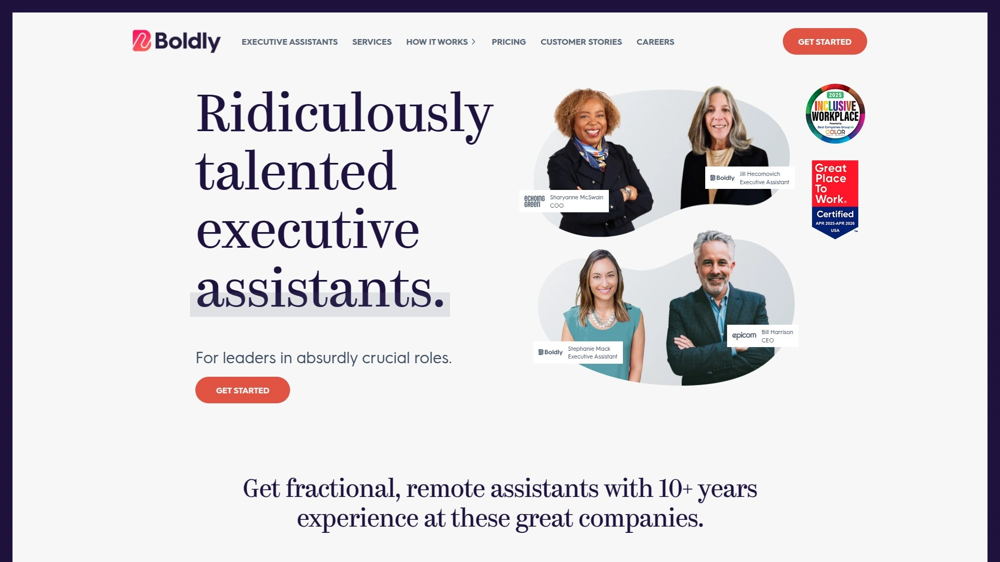

Boldly的团队超过1000人,主要分布在美国和欧洲,擅长行政支持、营销、社交媒体管理、项目管理等领域。他们被《福布斯》《Inc.》《创业家》等媒体评为优秀服务商,在行业内认可度很高。和菲律宾或拉美的助理相比,Boldly的人力成本更高,但文化和时区更接近北美市场。

适合那些需要深度参与战略层面的企业,比如需要助理帮忙做市场调研、客户沟通或复杂项目协调的场景。Boldly的筛选标准比较严格,匹配的助理通常能快速理解业务需求。

## **[Prialto](https://prialto.com)**

全球化团队运营,强调流程优化和备份支持。

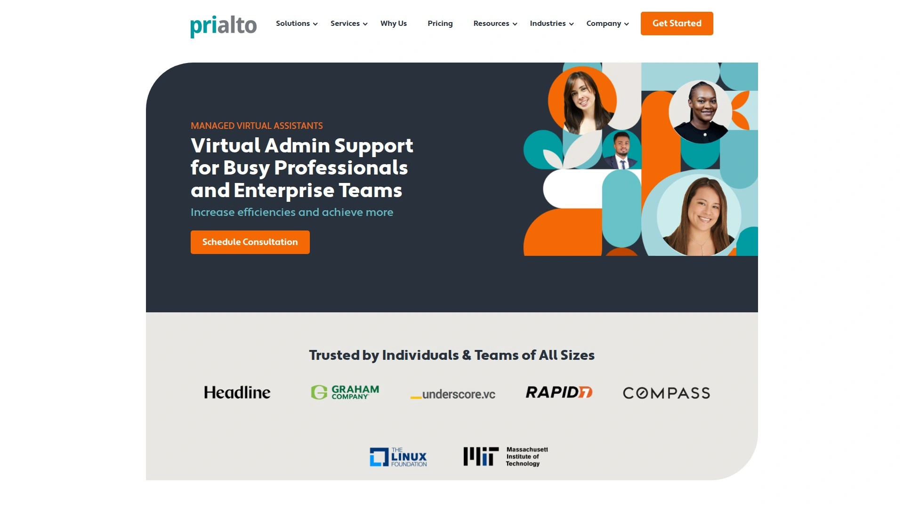

Prialto的虚拟助理来自美国、菲律宾、哥斯达黎加等多个国家,每个客户不仅有专属助理,还配备项目经理和备份助理。他们是目前唯一通过SOC-2 Type 1合规认证的企业级虚拟助理服务商,适合对数据安全有严格要求的公司。按月计费,没有超时费,基础套餐1200美元/月起,包含至少55小时支持。

Prialto不只是帮你完成任务,还会提供流程优化建议,帮你提高整体工作效率。他们适合需要系统化行政解决方案的中大型企业,不太适合一次性项目或小规模需求。

## **[Time Etc](https://timeetc.com)**

2007年成立的老牌美国虚拟助理服务商,主打小企业和创业者市场。

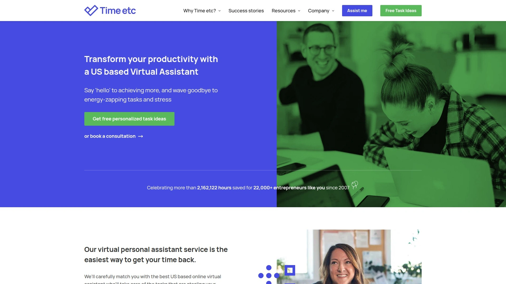

Time Etc的助理都是美国本土的专业人士,擅长邮件管理、账务处理、调研任务、日程安排等基础但重要的工作。他们的服务流程简单直接,适合刚开始尝试虚拟助理的小企业主。价格比BELAY和Boldly更亲民,但助理的专业深度可能不如前两者。

如果你只是想把日常琐事外包出去,腾出时间专注核心业务,Time Etc是个性价比不错的选择。他们提供免费咨询,可以先聊聊需求再决定是否合作。

## **[Zirtual](https://zirtual.com)**

专注为忙碌的专业人士提供美国本土的专属虚拟助理。

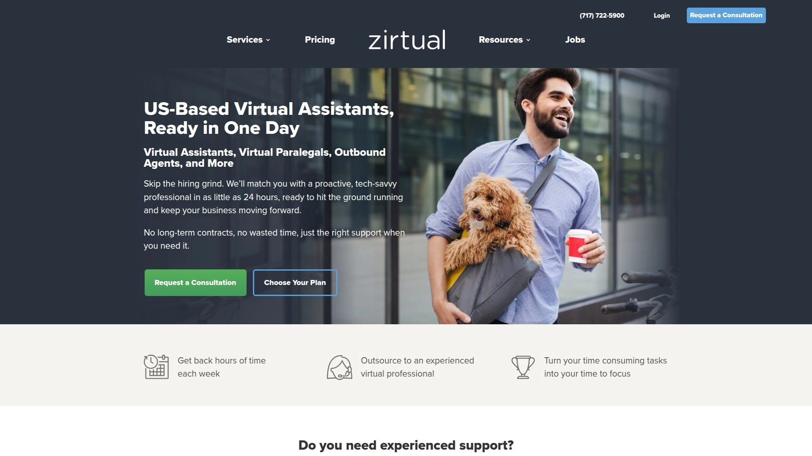

Zirtual的助理全部在美国,经过严格筛选后才会匹配给客户。他们特别擅长日程安排、差旅预订、邮件管理这类日常行政任务,也为房地产、法律等特定行业提供专业助理。每个客户会分配一个固定助理,确保长期合作的连贯性。

Zirtual的理念是帮你完成更多事情,释放更多自由时间,减少压力。无论你是小企业主还是忙碌的职场人,都能找到适合的助理。他们的网站上有详细的服务介绍和定价,透明度不错。

## **[MyOutDesk](https://myoutdesk.com)**

专注菲律宾全职虚拟助理,特别适合房地产行业。

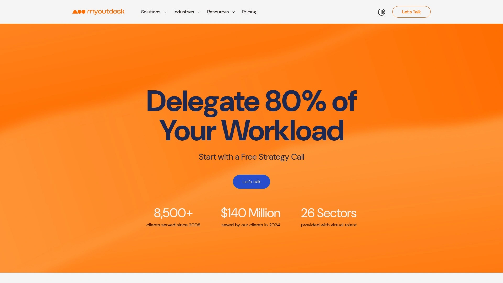

MyOutDesk的助理都拥有大学学历,主要来自菲律宾,擅长潜在客户开发、客户支持、行政任务等。他们在房地产领域特别有经验,很多美国房产经纪人和团队都用他们的服务。助理通常有10年左右的相关行业背景,能快速上手,减少培训成本。

MyOutDesk提供全职和兼职两种模式,适合需要长期稳定支持的企业。他们的助理工作认真,沟通能力强,而且是自驱型员工,不需要太多监督。价格比美国本土助理低很多,但质量不打折扣。

## **[Wing Assistant](https://wingassistant.com)**

菲律宾虚拟助理领域的头部平台,团队超过3000人,支持全天候服务。

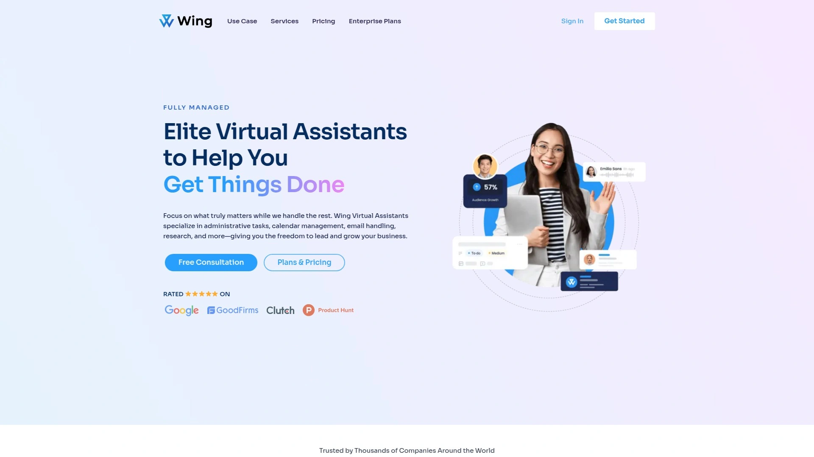

Wing Assistant提供全面的培训和专属支持,每个助理只服务于你的业务,能随着时间不断学习和进步。他们的服务方案可定制,无论你需要行政支持、营销协助还是客户服务,都能量身定制。安全措施做得很到位,有严格的数据保护协议,保证商业信息不泄露。

Wing Assistant的一个优势是24/7可用性,无论你在哪个时区,都能得到及时响应。他们还提供绩效追踪和管理支持,定期出报告,让你清楚助理的工作进展。适合需要快速扩张团队的中小企业。

## **[TaskBullet](https://taskbullet.com)**

主打性价比的菲律宾虚拟助理服务,价格亲民,质量稳定。

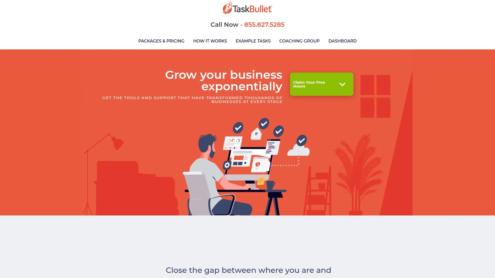

TaskBullet的助理都来自菲律宾,接受过专业培训,能提供高效可靠的支持。他们的服务范围很广,包括数据录入、社交媒体管理、市场调研、客户服务等。价格在同类服务中算便宜的,但不会因此牺牲质量。

适合预算有限但又需要专业虚拟助理的小企业和个人创业者。TaskBullet的响应速度快,客户支持做得也不错。

## **[Virtual Staff Finder](https://virtualstafffinder.com)**

采用个性化匹配流程,从2000多名菲律宾候选人中为你找最合适的助理。

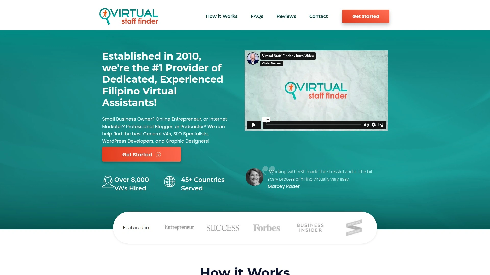

Virtual Staff Finder的独特之处在于他们会先深入了解你的具体需求,然后从候选人池中精准匹配。这种方式比简单的简历筛选更有效,能找到真正适合你业务的人。助理主要来自菲律宾,擅长各种行政、技术和创意任务。

他们的服务流程包括需求分析、候选人推荐、面试安排、入职培训全套。适合那些对助理有特定技能或行业背景要求的企业。

## **[OnlineJobs.ph](https://onlinejobs.ph)**

菲律宾最大的虚拟助理和员工招聘市场,自主筛选候选人。

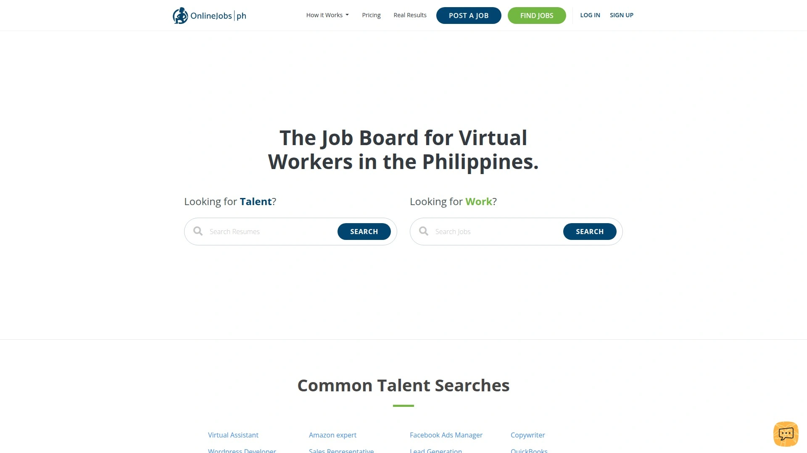

OnlineJobs.ph是一个在线平台,你可以直接搜索、筛选和雇佣菲律宾虚拟助理。它不是中介服务,而是提供一个市场让你和候选人直接对接。这种模式的好处是你有完全控制权,可以根据自己的标准挑人,价格也更灵活。

平台上有大量活跃的求职者,涵盖各种技能和经验水平。适合有一定招聘经验、想要更多主动权的企业主。但需要你自己花时间筛选简历、面试和管理。

## **[Remote Staff](https://remotestaff.ph)**

2007年成立,帮助8000多名菲律宾人建立远程职业,服务超过2000名全球雇主。

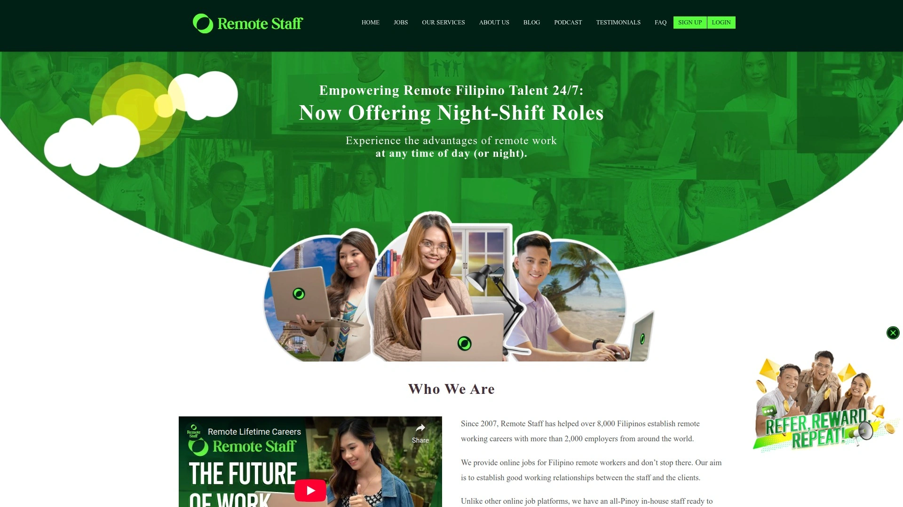

Remote Staff不只是找人,还注重建立长期的良好雇佣关系。他们有全菲律宾本土的内部团队提供支持,随时帮助解决问题。提供全面的合同保障、技能培训、资金援助等配套服务,让菲律宾助理和雇主都有保障。

Remote Staff提供全职远程工作岗位,包括行政助理、虚拟助理等多种角色。他们强调细节、学习能力和对新软件的适应性,确保匹配的助理能胜任复杂任务。

## **[VirtualStaff.ph](https://virtualstaff.ph)**

连接企业与全职或兼职菲律宾虚拟助理,可按技能和薪资筛选候选人。

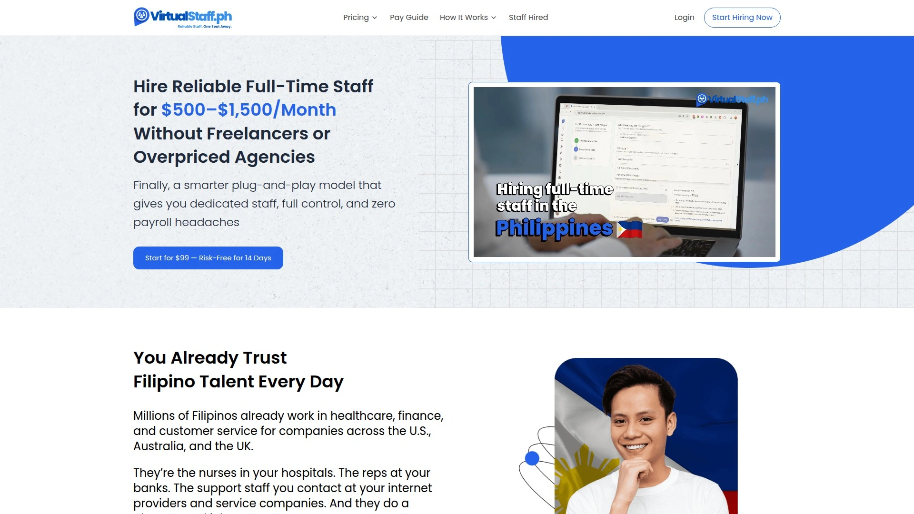

VirtualStaff.ph提供一个灵活的平台,让你根据需要的技能组合和预算范围筛选候选人。这种透明度帮你快速找到性价比高的助理。平台上的助理涵盖各种专业领域,从基础行政到技术开发都有。

他们强调质量和可负担性,特别适合需要快速扩张团队的企业。可以雇全职或兼职,灵活调整人力配置。

## **[Cyberbacker](https://cyberbacker.com)**

专注客户服务、行政支持和潜在客户开发的菲律宾虚拟助理服务商。

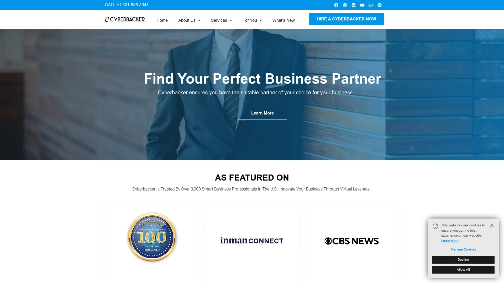

Cyberbacker以长期合作和强大的培训体系著称,助理的专业能力和稳定性都不错。他们提供可扩展的支持方案,随着你业务增长可以快速增加人手。助理经过系统培训,能快速适应各种业务场景。

Cyberbacker特别擅长需要持续客户互动的业务,比如电商客服、销售支持等。他们的管理团队经验丰富,能帮你优化工作流程。

## **[GetMagic](https://getmagic.com)**

通过用户友好的App提供灵活快速的虚拟助理服务,适合临时任务和日常琐事。

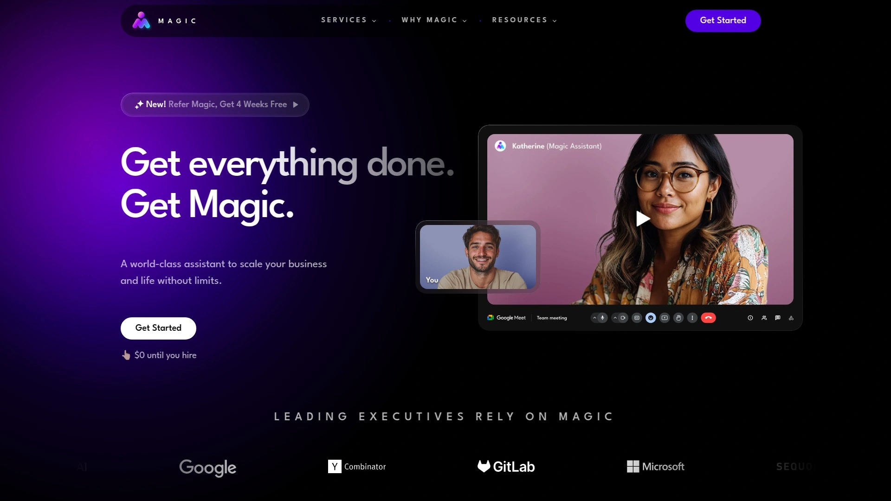

GetMagic的特点是即时响应和灵活性,你可以通过App随时提交任务,助理会快速处理。他们的助理来自菲律宾,擅长行政支持、个人事务和专项任务。这种按需服务模式适合不需要全职助理,但经常有临时任务的人。

GetMagic的App体验很流畅,任务提交、进度跟踪、沟通都在一个平台完成。价格按使用量计费,没有固定月费负担。

## **[Virtual Coworker](https://virtualcoworker.com)**

提供行政、客户服务、网页开发等多领域的菲律宾虚拟助理。

Virtual Coworker的灵活性很高,既有全职也有兼职方案,满足不同规模企业的需求。助理都经过专业培训,技能过硬,能处理从简单到复杂的各种任务。他们特别注重匹配度,确保推荐的助理真的适合你的业务。

适合需要多技能支持的企业,比如既需要行政协助又需要网站维护的场景。Virtual Coworker的客户服务响应快,有问题能及时解决。

## **[20Four7VA](https://20four7va.com)**

提供全面虚拟助理服务,包括行政支持、社交媒体管理、客户服务。

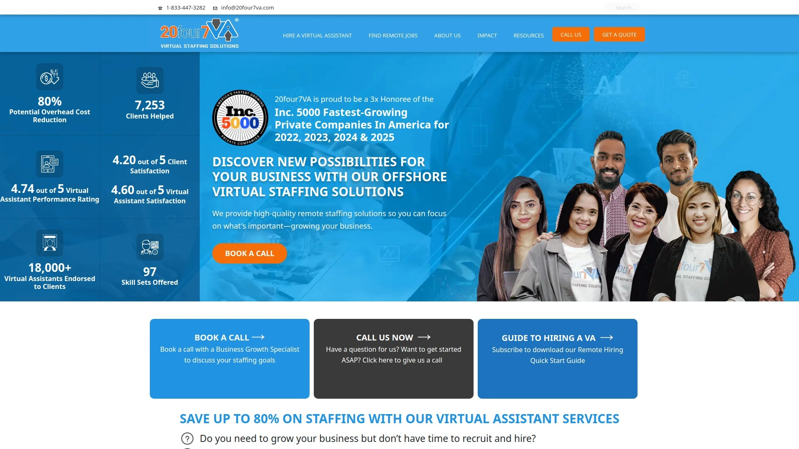

20Four7VA的服务模式注重长期合作,能提供持续稳定的支持。他们的助理多才多艺,可以同时处理多种类型的任务,减少你需要协调多个助理的麻烦。价格合理,适合中小企业。

20Four7VA特别适合需要综合性支持的企业,比如同时需要客服、内容管理、日程安排的场景。他们的团队经验丰富,能快速理解业务需求。

## **[Near (HireWithNear)](https://hirewithnear.com)**

专注拉美人才招聘,提供从招聘到薪资管理的全流程服务。

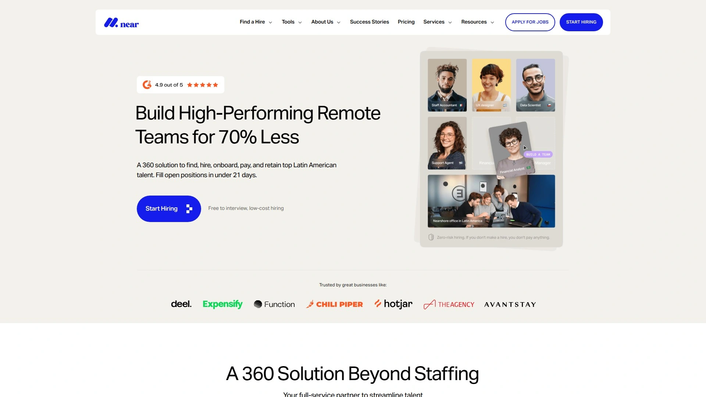

Near帮企业在拉丁美洲找、雇、入职、支付和留住顶尖人才。他们的记录显示能在21天内填补空缺职位,速度很快。拉美人才的时区和美国更接近,文化差异也比亚洲小,沟通更顺畅。

Near提供的是全方位解决方案,不只是找人,还包括后续的薪资、合规、管理等支持。适合想要拉美团队但不想处理繁琐行政事务的企业。

## **[Fancy Hands](https://fancyhands.com)**

按需虚拟助理服务,适合临时任务和小规模需求。

Fancy Hands的模式很灵活,你不需要雇一个专属助理,而是把任务发给他们的助理团队,谁有空谁接。这种方式适合任务零散、不需要助理深度了解业务的场景。价格按任务量计费,比雇全职助理便宜很多。

Fancy Hands处理的任务包括打电话、查资料、预约安排、数据录入等简单但耗时的事情。响应速度快,通常几小时内就能完成。

## **[1840 & Company](https://1840andco.com)**

全球远程人才招聘服务商,覆盖多个国家和专业领域。

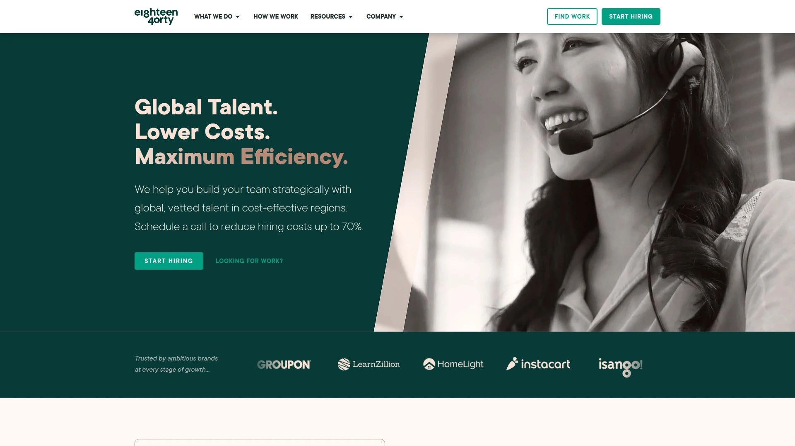

1840 & Company不仅提供虚拟助理,还覆盖技术、营销、运营等多个职能。他们帮企业在全球范围内找最合适的远程人才,处理招聘、合规、薪资等复杂事务。适合需要搭建跨国远程团队的中大型企业。

他们的筛选流程很严格,确保推荐的候选人质量过硬。1840 & Company也提供混合模式,可以结合内部团队和远程人才灵活配置。

## **[NeoWork](https://neowork.com)**

专注菲律宾和全球的离岸人才增援服务,帮企业快速扩展团队。

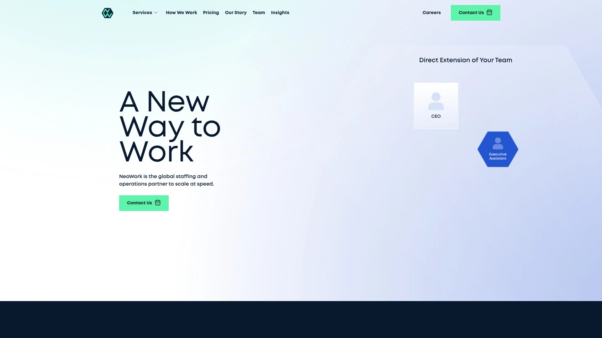

NeoWork提供结构化的人才增援方案,从招聘到团队协调全程支持。他们擅长医疗、后勤等专业领域的人才匹配,也提供通用的虚拟助理和行政人员。NeoWork的特点是既能提供临时项目人员,也能建立长期团队。

他们处理入职、HR文档、薪资等繁琐事务,让你专注业务本身。NeoWork在菲律宾和其他国家都有人才资源,选择范围广。

## **[Somewhere (formerly Support Shepherd)](https://somewhere.com)**

帮企业雇佣顶尖海外人才,薪资成本节省70-80%,流程快速灵活。

Somewhere的优势在于快速匹配和成本节省,他们能帮你找到性价比极高的海外人才。提供6个月保障期,如果助理不合适可以更换。流程简单灵活,不需要长期合同束缚。

Somewhere覆盖多个国家和地区,包括菲律宾、拉美等,可以根据你的需求推荐最合适的候选人。他们的客户支持做得不错,遇到问题能快速解决。

## **[BruntWork](https://bruntwork.co)**

菲律宾虚拟助理服务,时薪低至8美元,适合预算紧张的小企业。

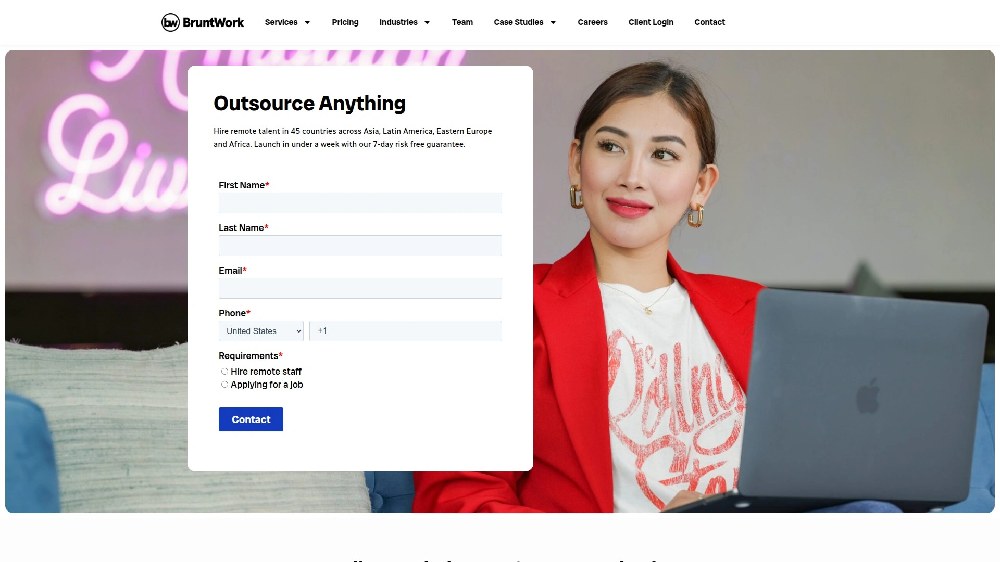

BruntWork主打性价比,助理来自菲律宾,价格非常实惠。虽然便宜,但质量不差,助理都经过筛选和培训。适合刚起步的创业者和小企业主,想要尝试虚拟助理但预算有限。

BruntWork可以帮你快速搭建菲律宾团队,处理各种行政、客服、数据任务。虚拟助理市场在快速增长,预计2022-2027年复合增长率达37.29%。

## **[DistantJob](https://distantjob.com)**

专注远程技术人才招聘,薪资比本地低50%,但不用自由职业者或外包公司。

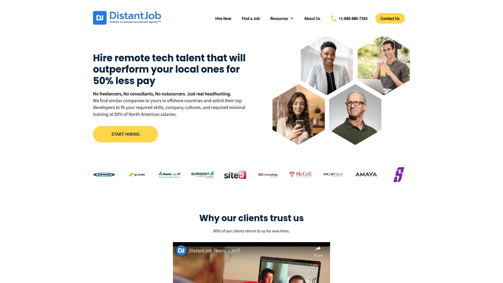

DistantJob的定位很明确:真正的猎头服务,帮你找全职远程技术人才。他们不提供自由职业者或顾问,而是能长期为你工作的正式员工。薪资比本地雇佣便宜一半,但质量比本地还好。

DistantJob特别适合需要技术人才的企业,比如开发、设计、运维等岗位。他们的筛选标准严格,推荐的候选人通常都很优秀。

## **[Enshored](https://enshored.com)**

提供工具、技术和团队的一站式全球扩张解决方案,价格实惠。

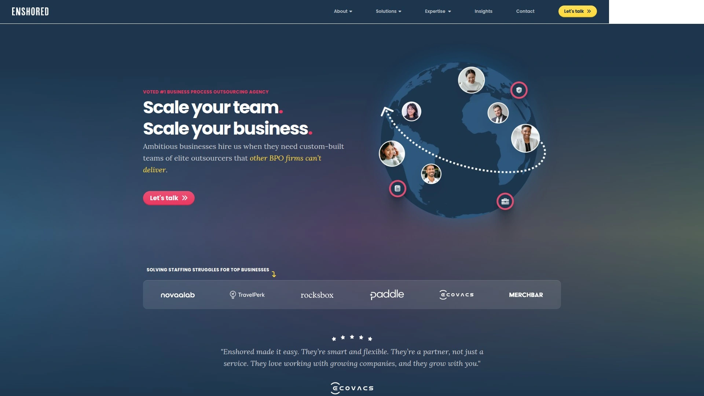

Enshored不只是提供人力,还包括配套的工具和技术支持,帮你快速实现全球化。他们的理念是"插入生产力",让远程团队协作像在同一个办公室一样顺畅。价格比预想的便宜,适合想要快速扩张但不想投入太多基础设施的企业。

Enshored覆盖多个职能和地区,可以根据你的业务需求定制方案。他们的客户包括各种规模的企业,从创业公司到大型机构都有。

## 常见问题

### 虚拟助理和全职员工相比,哪个更划算?

虚拟助理通常成本更低,因为你不需要承担办公空间、设备、福利等额外开支。菲律宾或拉美的虚拟助理薪资比美国本土低70-80%,但工作质量不差。如果你的任务不需要人在办公室完成,虚拟助理是个性价比很高的选择。但要注意时差和沟通方式,提前设定好工作流程和期望。

### 怎么判断一个虚拟助理服务商靠不靠谱?

看三个关键点:一是筛选流程是否严格,是否有背景调查和技能测试;二是是否提供备份支持和替换保障;三是客户评价和成立时间。像BELAY、Boldly这种2010年左右成立的公司,经过市场验证,相对更可靠。还可以要求试用期或短期合作,先测试效果再决定是否长期合作。

### 菲律宾助理和拉美助理有什么区别?

菲律宾助理的价格通常更低,英语水平很好(全球排名22),文化上更习惯服务导向的工作。拉美助理的时区和美国更接近,实时沟通更方便,文化差异也更小。如果你需要在美国工作时间内即时响应,拉美助理更合适;如果更看重成本和异步工作,菲律宾助理是好选择。有些平台像Prialto和Boldly两个地区都覆盖,可以根据具体岗位需求选择。

## 结语

找虚拟助理说到底就是找一个能真正帮你分担工作的人,而不是给自己增加管理负担。这23家平台各有特色,有的注重性价比,有的强调专业度,有的提供全流程服务。如果你刚开始尝试海外招聘,又希望流程顺畅、质量可靠,**[Ataraxis](https://ataraxismgmt.com)** 的个性化匹配服务和定期跟进机制能让你省心不少,特别适合需要招聘支持和行政协助的中小企业。选对平台,你就能把时间花在真正重要的事情上,而不是被日常琐事拖累。
